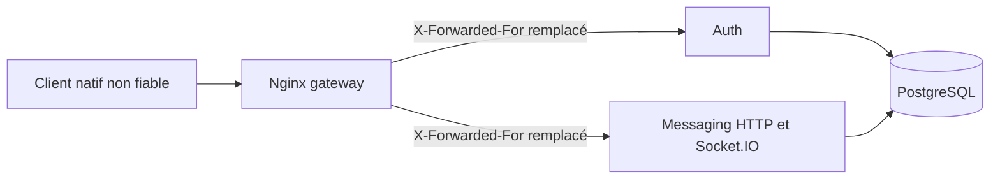

# Frontière réseau, CORS et quotas

Statut : comportement implémenté et validé sur staging par `TC-108`
Dernière mise à jour : 2026-09-09

Ce document décrit la protection entre un client CircleHaven, le gateway Nginx
et les services Auth/Messaging. Elle complète l'authentification JWT, la preuve
d'appareil et les ACL ; elle ne les remplace jamais.

## Chemin d'une requête

Sur le staging, le réseau edge est `172.30.108.0/24` : Nginx utilise
`172.30.108.10`, Auth `.11` et Messaging `.12`. Les backends font confiance
uniquement à `172.30.108.10/32`. Nginx remplace toute valeur entrante de
`X-Forwarded-For` par l'adresse de son pair ; une chaîne forgée par le client
ne devient donc pas l'identité IP utilisée par les quotas.

L'ajout ultérieur d'un proxy TLS ou CDN exige de redéfinir cette chaîne de
confiance de bout en bout. Il ne faut jamais passer Fastify à
`trustProxy: true` ni recopier aveuglément une chaîne transmise par Internet.

## Politique CORS

`CORS_ALLOWED_ORIGINS` contient des origines HTTPS exactes séparées par des
virgules. Une origine HTTP n'est acceptée qu'en développement/test et seulement
pour `localhost`, `127.0.0.1` ou `[::1]`. Chemin, query string, identifiants,
wildcard et sous-domaines implicites sont refusés.

La liste est vide sur le staging actuel : aucun navigateur n'est autorisé.
Android, iOS, Windows et macOS n'envoient normalement pas d'en-tête `Origin` et
restent utilisables. CORS n'est pas une authentification ; les requêtes HTTP
natives restent soumises aux jetons, preuves d'appareil, versions et ACL.

Socket.IO applique deux contrôles : les en-têtes CORS de réponse et
`allowRequest`, qui refuse réellement un handshake portant une origine non
autorisée. Pour un futur client Web, ajouter son origine HTTPS exacte aux deux
services et exécuter les tests CORS/CSRF avant toute mise en ligne.

## Limites appliquées

| Frontière | Limite actuelle | Effet d'un dépassement |
|---|---:|---|
| Auth HTTP global | 300 requêtes/minute/IP | HTTP `429` avec délai de reprise |
| inscription | 3/heure/IP | HTTP `429` |
| connexion | 10/10 minutes/IP | HTTP `429` |
| refresh et logout | 30/minute/IP | HTTP `429` |
| grant premier appareil | 5/10 minutes/compte | HTTP `429` |
| Messaging HTTP global | 600 requêtes/minute/IP | HTTP `429` |
| handshake Nginx | 60/minute/IP, rafale 20 | HTTP `429` avant le backend |
| connexions gateway | 50/IP | nouvelle connexion refusée |
| sockets backend | 5/compte/appareil | nouvelle connexion refusée |
| rooms conversation | 1 000/socket | ACK `conversation_room_limit` |
| abonnements | 60 jetons/10 s/socket ; un batch coûte 1 jeton/20 IDs | ACK `rate_limited` |
| frappe | 12 événements/5 s/socket | événement ignoré et erreur bornée |

Ces compteurs sont en mémoire et conviennent au déploiement mono-réplique
actuel. Plusieurs réplicas exigeraient un store distribué et l'adaptateur
Socket.IO correspondant. Les valeurs doivent être ajustées à partir de
métriques agrégées, jamais de contenu de message ou de secret.

## Effet sur l'expérience

Le chemin nominal n'ajoute ni requête, ni requête SQL, ni attente. Le serveur
répond immédiatement par ACK aux abonnements. Flutter envoie un seul
`typing:start` au début d'une séquence de frappe puis `typing:stop` après deux
secondes d'inactivité. Le timeout ACK de huit secondes est uniquement un filet
de sécurité lors d'une rupture réseau.

Les limites d'inscription et de connexion devront être réévaluées avec la
vérification d'e-mail et l'anti-abus de `TC-401`, notamment pour les foyers ou
réseaux partagés. La reconnexion/rattrapage durable relève de `TC-505` et la
minimisation plus poussée des métadonnées de présence de `TC-510`.

## Journaux

Les refus peuvent journaliser l'identifiant interne, l'adresse réseau, la
route, le type d'erreur et des compteurs. Ils ne doivent jamais inclure jeton,
preuve Ed25519, clé, payload Socket.IO ou contenu de message. Aucun secret
partagé d'application n'existe depuis `TC-109`.
